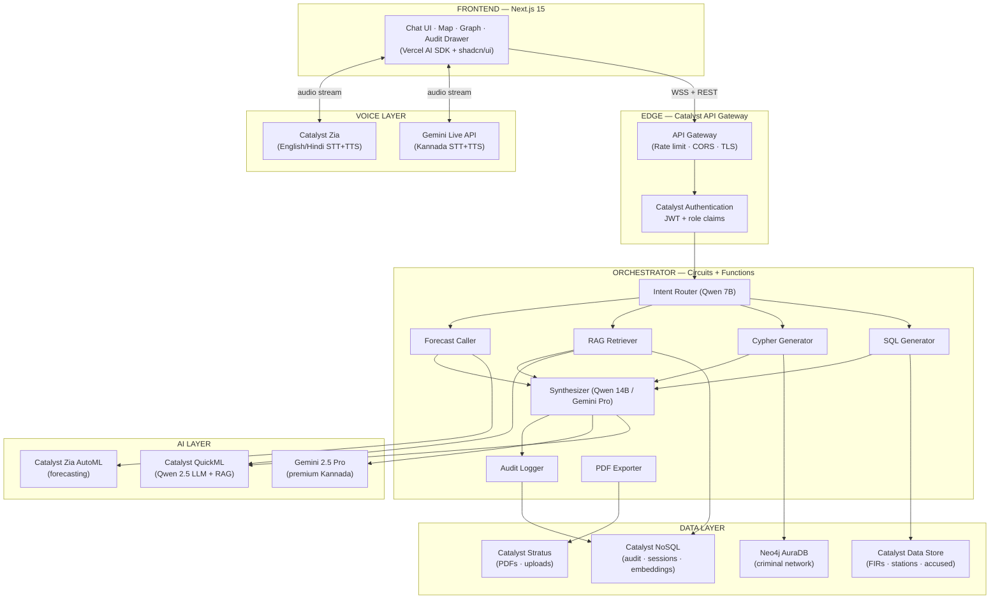
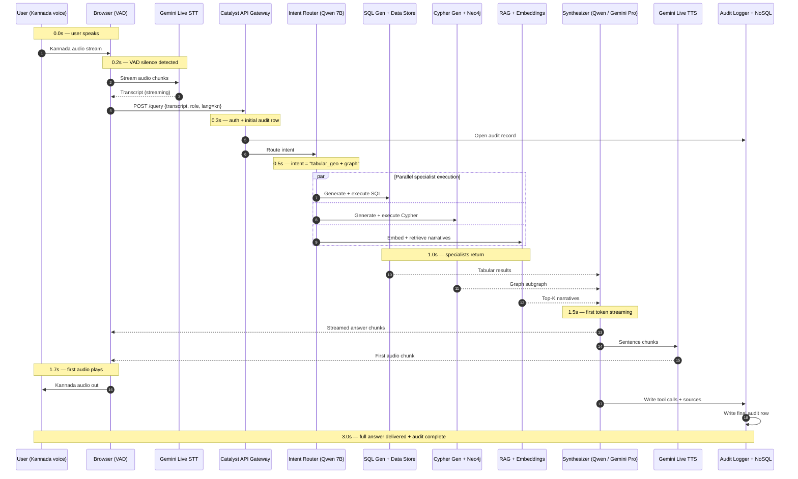
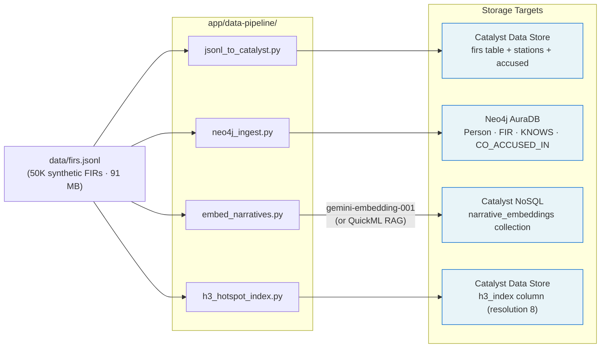
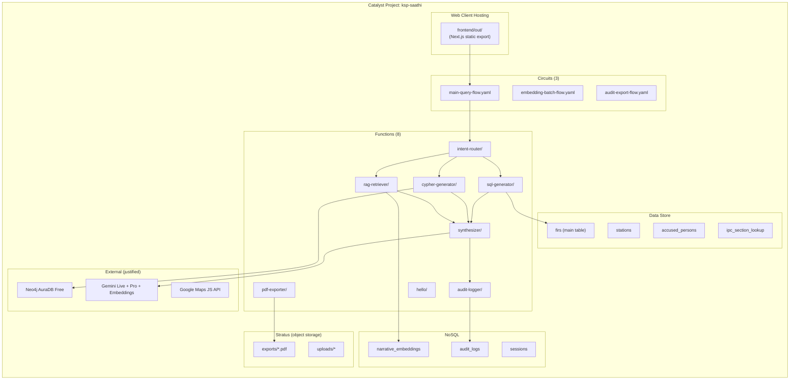
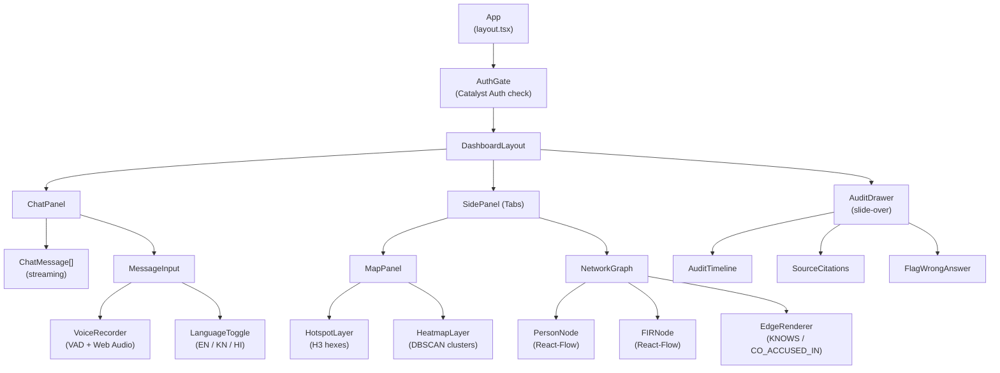
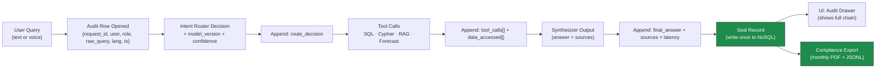

# KSP Saathi — Architecture Diagrams

> Visual reference for the KSP Saathi system architecture. All diagrams render natively in GitHub, GitLab, and most Markdown viewers via Mermaid. ASCII fallback included where rendering may fail.
>
> **Source of truth:** [`design.md`](../design.md) Section 6. If anything here conflicts with `design.md`, `design.md` wins — update this file to match.

---

## 1. High-Level System Architecture (C4 Context)

External actors interact with KSP Saathi, which in turn delegates to Catalyst-native services and a small set of justified Google Cloud + Neo4j augmentations. Everything runs in India (Catalyst India DC + `asia-south1`).

```mermaid
flowchart LR
    subgraph Actors["External Actors"]
        INV["Investigator<br/>(Browser / Desktop)"]
        OFF["Officer<br/>(Mobile PWA)"]
        ADM["KSP IT Admin<br/>(Console)"]
    end

    subgraph KSPS["KSP Saathi Platform"]
        APP["Conversational AI<br/>Web + Voice<br/>9 features"]
    end

    subgraph Catalyst["Zoho Catalyst (India DC)"]
        CAT["Hosting · Auth · Functions<br/>Circuits · Data Store · NoSQL<br/>Stratus · QuickML · Zia"]
    end

    subgraph GCP["Google Cloud (asia-south1)"]
        GLIVE["Gemini Live API<br/>(Kannada STT/TTS)"]
        GPRO["Gemini 2.5 Pro<br/>(Premium synth)"]
        GMAPS["Google Maps<br/>Platform"]
        GEMB["gemini-embedding-001"]
    end

    subgraph Graph["Neo4j AuraDB Free (GCP)"]
        NEO["Criminal Network Graph"]
    end

    INV -->|HTTPS + WSS| APP
    OFF -->|HTTPS + WSS| APP
    ADM -->|Admin Console| APP

    APP --> CAT
    APP --> GLIVE
    APP --> GPRO
    APP --> GMAPS
    APP --> GEMB
    APP --> NEO

    classDef catalyst fill:#FF6B35,stroke:#333,color:#fff
    classDef gcp fill:#4285F4,stroke:#333,color:#fff
    classDef graph fill:#018BFF,stroke:#333,color:#fff
    class CAT catalyst
    class GLIVE,GPRO,GMAPS,GEMB gcp
    class NEO graph
```

**What this shows:** Three user personas (PSI/PI/DySP in browser, field officers on mobile PWA, IT admins) reach a single Next.js app. The app routes ~90% of work to Catalyst-native services and only crosses into GCP for documented gaps: Kannada voice (Gemini Live), graph DB (Neo4j), maps, and premium Kannada synthesis. All data flows stay inside Indian DCs for IT Act 2008 compliance.

### ASCII Fallback for Diagram 1

```
┌─────────────────┐     ┌─────────────────┐     ┌─────────────────┐
│  Investigator   │     │     Officer     │     │   KSP IT Admin  │
│    (Browser)    │     │  (Mobile PWA)   │     │    (Console)    │
└────────┬────────┘     └────────┬────────┘     └────────┬────────┘
         │                       │                       │
         └───────────────────────┼───────────────────────┘
                                 │ HTTPS / WSS
                    ┌────────────▼────────────┐
                    │     KSP SAATHI APP      │
                    │  (Next.js · 9 features) │
                    └────┬───────────┬────────┘
                         │           │
            ┌────────────┘           └─────────────┐
            │                                      │
   ┌────────▼────────┐                  ┌─────────▼─────────┐
   │   CATALYST      │                  │   GOOGLE CLOUD    │
   │   (India DC)    │                  │   (asia-south1)   │
   │ ─────────────── │                  │ ───────────────── │
   │ Hosting · Auth  │                  │  Gemini Live API  │
   │ Functions       │                  │  Gemini 2.5 Pro   │
   │ Circuits        │                  │  Maps Platform    │
   │ Data Store      │                  │  Embeddings       │
   │ NoSQL · Stratus │                  └─────────┬─────────┘
   │ QuickML · Zia   │                            │
   └─────────────────┘                  ┌─────────▼─────────┐
                                        │   Neo4j AuraDB    │
                                        │ (Criminal Graph)  │
                                        └───────────────────┘

                       ALL DATA IN INDIA
```

---

## 2. Component Architecture (C4 Container)

Each container is a deployable, ownable unit. Frontend ships to Catalyst Hosting; backend logic is split between Functions (per-task compute) and Circuits (orchestration). Stateful tier separates structured (Data Store) from semi-structured (NoSQL), graph (Neo4j), and blobs (Stratus).



**What this shows:** The orchestrator is the brain — eight specialized Functions wired together by Circuits. The Intent Router classifies; specialists run in parallel; the Synthesizer merges results and streams the answer. The Audit Logger writes on every turn so explainability is non-optional.

---

## 3. Single Voice Query Sequence (Kannada Path)

This is the **happy path** for a Kannada voice query. Latency annotations match the budget in [`design.md`](../design.md) Section 9.1. Anything past 3.5s breaks the demo promise.



**What this shows:** Parallelism is the trick. Once intent is classified at 0.5s, three specialists fan out simultaneously; the Synthesizer joins them at 1.5s and starts streaming audio at 1.7s — that's the metric the judges hear. Audit logging happens on the critical path so no answer ever ships without traceability.

---

## 4. Data Flow Diagram (Ingestion Pipeline)

Cold-load pipeline that takes 50K synthetic FIRs from local JSONL into all three storage backends. Each script is independently runnable; they fan out from the same source file.



**What this shows:** One canonical source, four parallel ingestion paths. The embedder is the only step that calls out to GCP (multilingual Kannada quality), and only if Catalyst's built-in QuickML RAG embedder fails the A/B eval. H3 indexing happens in app code because Catalyst Data Store has no spatial type.

---

## 5. Catalyst Deployment Topology

Where every artifact physically lives in the Catalyst project. This is the answer to "what gets deployed where" — useful for `catalyst deploy` debugging.



**What this shows:** The whole system fits in one Catalyst project. Eight Functions, three Circuits, four Data Store tables, three NoSQL collections, two Stratus buckets — plus three external services with documented justification. Nothing is hand-rolled outside Catalyst's deploy pipeline.

---

## 6. Frontend Component Tree

React component hierarchy for the Next.js 15 app. Lazy-loaded panels are mounted on tab activation to keep initial JS payload under 200KB gzipped.



**What this shows:** The chat is always-on (top of the page); map and graph share a tabbed side panel; the audit drawer slides over from the right when "Why?" is clicked. Voice and language controls live inside the input bar so they feel like part of typing, not a separate mode.

---

## 7. RBAC Matrix Visualization

The Catalyst Authentication JWT carries a `role` custom claim; every Function reads it and applies row-level filters before any data leaves the boundary. The matrix below is enforced both in SQL (Data Store row policies) and in app code (defense in depth).

```
┌──────────────────┬──────────────┬──────────────┬──────────────┬──────────────┐
│ Role             │ Read Scope   │ Write Scope  │ PII Access   │ Special      │
├──────────────────┼──────────────┼──────────────┼──────────────┼──────────────┤
│ constable        │ Own station, │      —       │ Masked       │      —       │
│                  │ last 30d     │              │              │              │
├──────────────────┼──────────────┼──────────────┼──────────────┼──────────────┤
│ sub_inspector    │ Own station, │ Witness      │ Partial      │ Mobile-only  │
│                  │ all time     │ statements   │              │              │
├──────────────────┼──────────────┼──────────────┼──────────────┼──────────────┤
│ inspector        │ Sub-division │ Case notes   │ Full (own)   │      —       │
├──────────────────┼──────────────┼──────────────┼──────────────┼──────────────┤
│ sho              │ Full station │ All          │ Full         │ Briefings    │
├──────────────────┼──────────────┼──────────────┼──────────────┼──────────────┤
│ dcp              │ District     │ Read-only    │ Full         │ Cross-stn    │
├──────────────────┼──────────────┼──────────────┼──────────────┼──────────────┤
│ scrb_analyst     │ State-wide   │ Reports      │ Aggregates   │ No case PII  │
│                  │ aggregates   │              │ only         │              │
├──────────────────┼──────────────┼──────────────┼──────────────┼──────────────┤
│ admin            │ All          │ All          │ Full         │ Audit access │
└──────────────────┴──────────────┴──────────────┴──────────────┴──────────────┘
```

**What this shows:** Seven roles, four enforcement dimensions. A constable querying for an out-of-station case will get a polite "not authorized" — and the attempt is logged. SCRB analysts see aggregates without ever touching case-level PII, satisfying DPDP Act 2023 minimization.

---

## 8. Audit Chain Visualization

Every query becomes an immutable audit record. The chain below is what the "Why?" drawer renders visually and what the IT Act 2008 export job ships to KSP's compliance team.



**What this shows:** The audit record grows incrementally as the query moves through the pipeline, then gets sealed on completion. Nothing can be amended after seal — corrections create a new linked record. This is the spine of Feature 8 (Explainable AI) and the legal evidence for Feature 9 (RBAC enforcement).

---

## Maintenance Notes

- **When to update this file:** any change to the locked architecture in `design.md` Section 6, any new Function, any new external service.
- **How to verify Mermaid renders:** push to GitHub and open the file — GitHub renders Mermaid natively. For local preview use VS Code's "Markdown Preview Mermaid Support" extension.
- **ASCII fallback policy:** required for Diagram 1 (the one most likely to be screenshotted into the pitch deck). Optional for the rest.

*Last updated: 2026-06-16 · Owner: Person B (Orchestrator) · Cross-ref: `design.md` Section 6, `decisions.md`*
